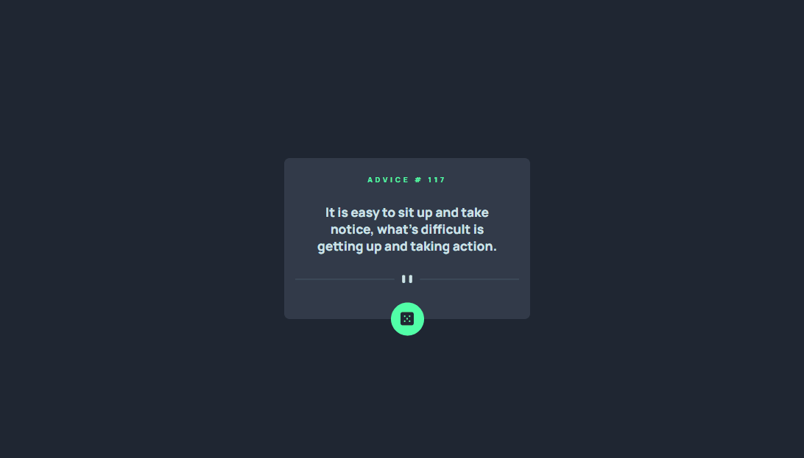

# Frontend Mentor - App Gerador de Conselhos
Um projeto com HTML, CSS e JavaScript proposto pelo curso DevQuest, disponível no site frontendmentor.

[]

## Tecnologias utilizadas
- HTML
- CSS
- JavaScript

## O desafio
O desafio proposto pelo curso Devquest, consiste em criar uma app gerador de conselho mais semalhante possível com o design do frontend mentor. Ao clicar no botão do card, faz com que troque por outro conselho aleatoriamente.

## Construção
- Marcação HTML5 Semântica
- Proprieades do CSS
- FlexBox
- Implementação da API de conselhos
- Requisição com o fetch

## Desenvolvimento Contínuo 
Desde então continuarei desenvolvendo projetos com HTML, CSS, JavaScript e posteriormente iniciar os estudos com React.js.